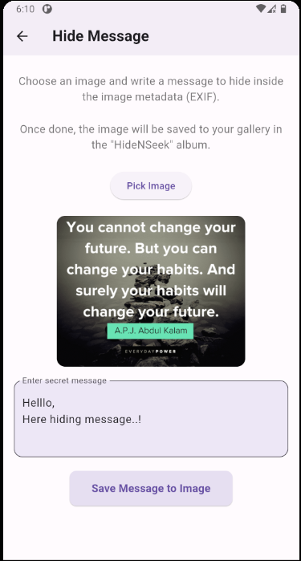

# 🕵️‍♀️ Hide N Seek

**Hide N Seek** is a stealthy and fun Flutter app that lets you hide secret messages inside your images using **EXIF metadata**, and reveal them anytime you want. Like a digital invisible ink for your photo memories!

---

## ✨ Features

- 📷 **Pick or capture images** using camera or gallery, powered by `image_picker`
- ✍️ **Write and embed a secret message** into the image’s EXIF data via `exif`
- 💾 **Save edited images** directly to your gallery inside a custom album using `gallery_saver`
- 🔐 **Hide messages inside EXIF `UserComment` field**, invisible to normal image viewers
- 🕵️‍♂️ **Reveal hidden messages** from any image that has EXIF secrets stored
- 📁 **Permission handling** is smooth and secure using `permission_handler`
- 🧼 Simple, clean, and beginner-friendly UI for a smooth experience

---

## 🧪 Use Case Example

1. Launch **Hide N Seek** and choose an image or take a new one.
2. Type your secret message and tap the save message to image button.
3. The app stores your message in the EXIF metadata and saves the image to the **HideNSeek** album.
4. Later, go to the **Reveal** section, load the image, and uncover the hidden message like a true detective 🕵️

---

## 🖼️ Screenshots

<p align="left">
  
  
  

</p>


---

## 📱 Getting Started

To run the app locally:

```bash
flutter pub get
flutter run
